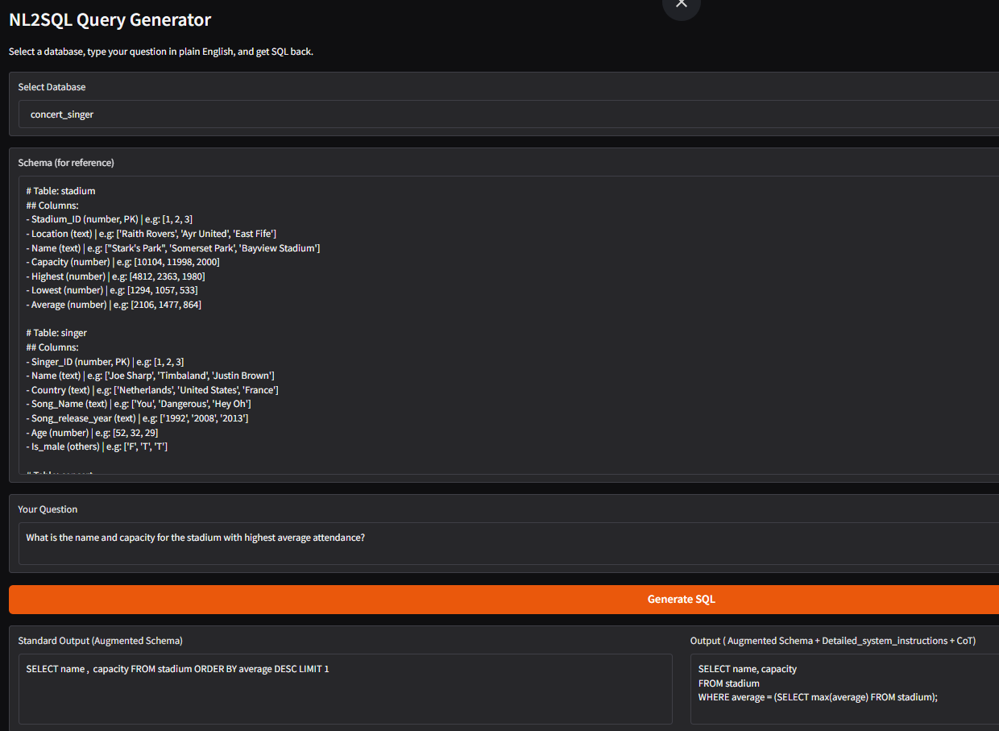
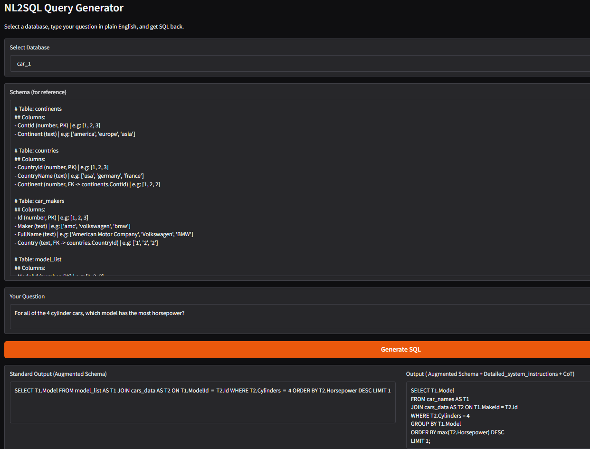
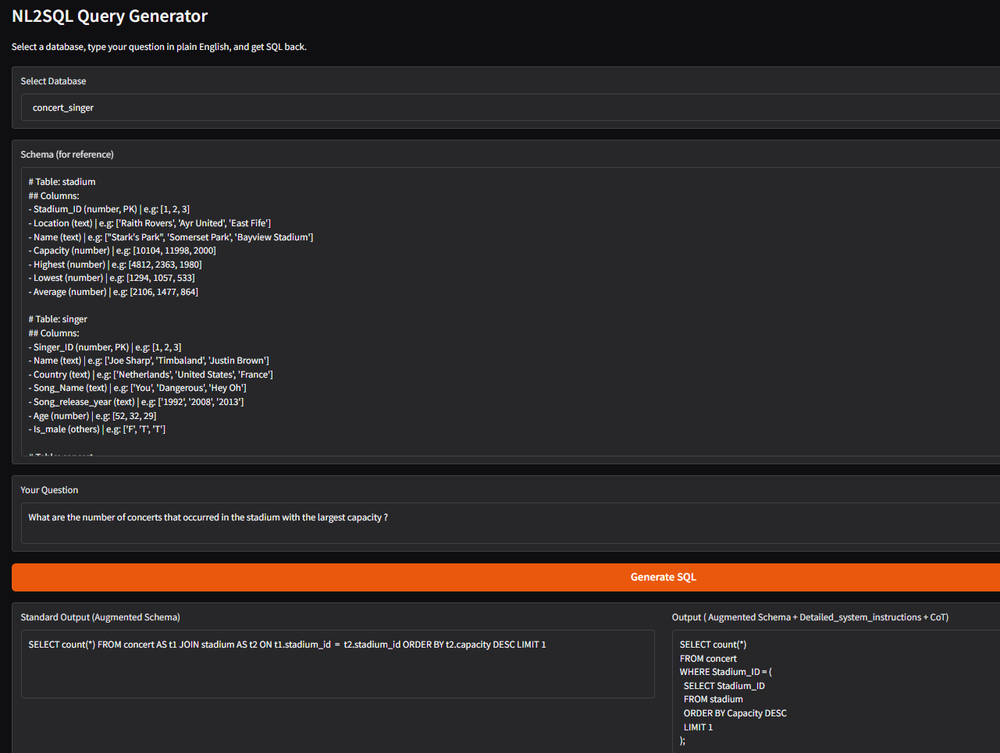
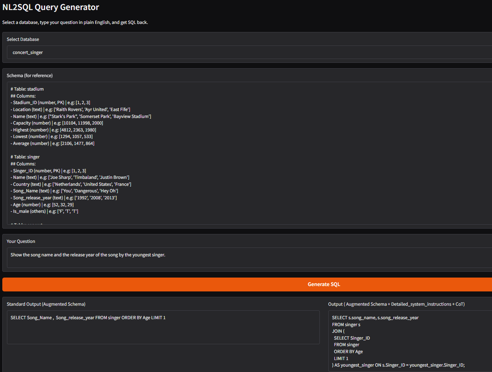

# Fine-tuning Llama 3.1 8B for NL2SQL: 84% Execution Accuracy on Spider

**TL;DR:** Fine-tuned Meta's Llama 3.1 8B Instruct using QLoRA (4-bit quantization + LoRA adapters) on the Spider NL2SQL benchmark. Trained on Kaggle's free dual T4 GPUs. Achieved **84% Execution Accuracy** on the Spider validation set — matching GPT-3.5 zero-shot performance with an 8B model on free hardware.

🚀 **[Live Demo](https://huggingface.co/spaces/Rickster1995/nl2sql-demo)** &nbsp;|&nbsp; 📦 **[Model Adapter](https://huggingface.co/Rickster1995/nl2sql-llama3-qlora)** &nbsp;|&nbsp; 💻 **[GitHub](https://github.com/mehulpranay/SQL-generator)**

---

## Accuracy Progression

| Step | Change | Execution Accuracy |
|---|---|---|
| Phi-2 2.7B baseline | Unaugmented schema | 40% |
| Llama 3.1 8B | Unaugmented schema | 70.89% |
| + Column order fix | Normalise result tuple order | 72% |
| + Augmented inference | Sample rows, 142 examples | 75% |
| + Token count fix | All 301 wrong/error examples | 77.27% |
| + Augmented fine-tuning | 6,607 training examples | 81% |
| + Agentic loop + CoT | Chain-of-thought + retry on failures | **84%** |

---

## Live Demo




> Standard and Agentic outputs side by side. Both correct on a simple aggregation query — standard uses `ORDER BY + LIMIT`, agentic constructs a subquery. For simple queries the standard prompt is cleaner and faster.

---

## Why NL2SQL?

SQL generation sounds like a solved problem — until you realize GPT-3.5 with zero-shot prompting only gets 70% on Spider. This project matched that score with an 8B model on a free Kaggle GPU by making one non-obvious bet: **schema representation matters more than model size.**

Spider is the standard benchmark for this problem. It has ~7,000 training examples across 140+ databases spanning hospitals, universities, concerts, and airlines. The validation set uses **entirely different databases** than training — so memorizing schema names gets you nowhere. The model has to generalize to unseen table structures.

---

## Where Standard Fails, Agentic Fixes It

**Example 1 — Mapping Error (car_1 database)**





> **Question:** "For all of the 4 cylinder cars, which model has the most horsepower?"
>
> Standard joined `model_list` to get `Model` — but `model_list.Model` contains generic model families (amc, audi, bmw), not specific car names. The correct table is `car_names`. Agentic's Step 2 verification cross-referenced sample rows, identified `car_names` as the primary source, and added `GROUP BY + max()` for correct aggregation.

---

**Example 2 — Subquery Logic (concert_singer database)**





> **Question:** "What are the number of concerts that occurred in the stadium with the largest capacity?"
>
> Standard used `JOIN + ORDER BY + LIMIT` — which orders the joined rows by capacity but counts only one row, making the result meaningless. Agentic correctly used a subquery to first identify the stadium with maximum capacity, then counted concerts for that specific stadium only.

---

## Architecture

```
User Question
      ↓
Schema Formatter (PK/FK annotations + sample rows)
      ↓
Prompt Builder (Llama 3.1 chat template)
      ↓  
QLoRA Fine-tuned Llama 3.1 8B (Standard or Agentic prompt)
      ↓
extract_sql_from_reasoning() (regex + fallback)
      ↓
Generated SQL
```

---

## Schema Representation: The Key Insight

Most NL2SQL tutorials dump raw `CREATE TABLE` strings into the prompt. This project uses a custom formatter that produces clean, human-readable schema with explicit PK/FK annotations and sample column values:

```
# Table: car_names
## Columns:
- MakeId (number, PK) | e.g: [1, 2, 3]
- Model (text, FK -> model_list.Model) | e.g: ['chevrolet', 'buick', 'plymouth']
- Make (text) | e.g: ['chevrolet chevelle malibu', 'buick skylark 320']

# Table: cars_data
## Columns:
- Id (number, PK, FK -> car_names.MakeId) | e.g: [1, 2, 3]
- Horsepower (text) | e.g: ['130', '165', '150']
- Weight (number) | e.g: [3504, 3693, 3436]
```

Sample rows let the model see that `Horsepower` lives in `cars_data`, not `car_names`. This structural signal is what turns column hallucination into correct JOIN paths.

---

## Agentic Prompt: SQL Architect + Chain-of-Thought

The agentic prompt replaces the generic "convert to SQL" instruction with an expert persona and forces explicit reasoning before writing SQL:

```
You are an expert SQL Architect.
STRICT RULE for STEP 2 (VERIFICATION):
1. Cross-reference the Question against Table Names and Sample Rows.
2. DIRECTNESS: If multiple tables have the column, pick the Primary source.
3. SAMPLES: If the question asks for 'names' but sample rows are IDs, JOIN to get text.
4. NO HALLUCINATION: Only use tables and columns present in the schema.

### LOGIC ANALYSIS
[STEP 1: ATTRIBUTES] The required data points are:
[STEP 2: VERIFICATION] Table selection and sample check:
1. Primary Column:
```

The chain-of-thought anchor forces attribute mapping and table verification before any SQL is written. Suppressing this reasoning kills accuracy — the reasoning trace *is* the answer.

---

## Model & Training Setup

**Base model:** `meta-llama/Meta-Llama-3.1-8B-Instruct` (loaded via Unsloth in 4-bit)

**QLoRA config:**
- Rank: r=16, alpha=16
- Target modules: q, k, v, o, gate, up, down projections
- Dropout: 0.05
- Quantization: NF4, double quant

**Training:**
- Dataset: Spider (6,607 examples after 2048-token filter)
- Hardware: Kaggle dual T4 (free)
- Optimizer: paged_adamw_8bit, lr=5e-5, cosine schedule
- Key: `train_on_responses_only` — model only computes loss on SQL tokens, not schema

---

## Evaluation: Execution Accuracy

BLEU and exact string match are meaningless for SQL — `SELECT COUNT(*)` and `SELECT count(*)` are identical queries that score 0 on exact match. This project uses **Execution Accuracy**: run both predicted and ground-truth SQL against the actual SQLite database, compare result sets using `Counter` equality (order-insensitive).

---

## Key Learnings

**1. Schema representation is load-bearing.** PK/FK annotations and sample rows are not nice-to-haves — they're what enables multi-table queries and eliminates column hallucination.

**2. Train-inference mismatch kills gains.** Augmenting only at inference gave ~5%. Fine-tuning on augmented data gave 10%+. The model needs to learn *how to use* the extra information, not just see it.

**3. Chain-of-thought is not optional for hard queries.** The reasoning trace is the answer — suppress it and you suppress the correct SQL.

**4. Token budget awareness matters.** CoT adds tokens. A simple length check (`use_reasoning = token_length < 1400`) balances reasoning quality against context limits.

**5. Execution Accuracy is the only honest metric for SQL.** Run the SQL. Compare result sets.

---

## When Standard Wins

CoT has a complexity bias — it tends to over-engineer simple queries where the standard prompt is cleaner and faster. Two examples:

**Example 1 — Simple aggregation (concert_singer database)**


> **Question:** "What is the name and capacity for the stadium with highest average attendance?"
>
> Standard: `SELECT name, capacity FROM stadium ORDER BY average DESC LIMIT 1`
> Agentic: `SELECT name, capacity FROM stadium WHERE average = (SELECT max(average) FROM stadium)`
>
> Both return the same result. Standard is one clean line. Agentic constructed an unnecessary subquery. For single-table aggregation, `ORDER BY + LIMIT` is idiomatic and sufficient.

---

**Example 2 — Single table lookup (concert_singer database)**



> **Question:** "Show the song name and release year of the song by the youngest singer."
>
> Standard: `SELECT Song_Name, Song_release_year FROM singer ORDER BY Age LIMIT 1`
> Agentic: Self-JOIN subquery to first isolate the youngest Singer_ID, then retrieve song fields.
>
> Again both are correct, but standard solved it in one line. Agentic's Step 2 verification triggered an unnecessary JOIN path because it saw a FK column and assumed a multi-table problem. The lesson: CoT verification rules are tuned for hard queries and can misfire on easy ones.

**Takeaway:** The right strategy is adaptive — use the agentic prompt for multi-table queries and aggregations involving FK traversal, fall back to standard for single-table lookups. A token-length heuristic (`use_cot = estimated_joins > 1`) is a reasonable proxy.

---

## Limitations

- Only covers Spider benchmark databases (7 pre-loaded schemas in the demo)
- SQLite syntax only — no PostgreSQL/MySQL specific functions
- No retry loop in the demo (agentic loop implemented in evaluation notebook)
- CoT can overcomplicate simple queries — standard prompt is sometimes cleaner
- 3+ table JOINs with ambiguous column names remain a failure mode

---

## What's Next

- RAG-based schema pruning — embed column chunks, retrieve top-k by question similarity
- Fine-tuning on agentic prompt format — closes the remaining train-inference mismatch
- DPO fine-tuning — execution success/failure as reward signal for logical reasoning failures

---

## Resources

| Resource | Link |
|---|---|
| Live Demo | [HuggingFace Spaces](https://huggingface.co/spaces/Rickster1995/nl2sql-demo) |
| Model Adapter | [Rickster1995/nl2sql-llama3-qlora](https://huggingface.co/Rickster1995/nl2sql-llama3-qlora) |
| Training Notebook | [Kaggle](https://www.kaggle.com/code/mehulkumar99/spider-question-to-sql-query) |
| Inference Notebook | [Kaggle](https://www.kaggle.com/code/mehulkumar99/inference-notebook-for-question-to-sql-query) |
| Agent Notebook | [Kaggle](https://www.kaggle.com/code/mehulkumar99/agentic-loop-addressing-syntax-errors) |
| RAG Notebook | [Kaggle](https://www.kaggle.com/code/mehulkumar99/rag-sql) |
| GitHub | [SQL-generator](https://github.com/mehulpranay/SQL-generator) |
| Dataset | [Spider](https://huggingface.co/datasets/spider) |